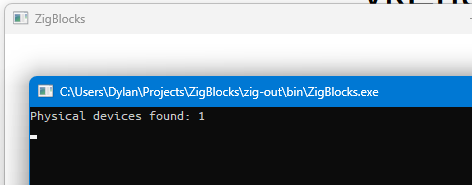

# It's time to Vulk
One thing that always confuses the hell out
of me is dependency management - especially
in c/c++ projects. It's time to add a layer of
complexity and throw Zig in the mix!

## The SDK
I spent a good amount of time reading about Vulkan
before I decided to dive into this and various tutorials all
recommend installing the SDK. It's 4GB, but that's
not uncommon for an SDK - plus it comes with lots
of tools that might help me in the future.

The real advantage is that it comes with all the
header files and libraries I need to get my program
running.

## The lib
So, I'm pretty sure I don't need the include
directories because I'm writing Zig and not c,
but if `cImport` and `cInclude` end up working
with the Vulkan header files, maybe it could
speed up some work. I have a feeling I'll be
manually binding anyways, though.

In any case, I've created a `dependency` folder
in the root of my project and added a lib folder
to that. I don't know which libraries I need
specifically, so I just threw the most obvious one
in there for now ("vilkan-1.lib") and if I get
linker errors, I will just keep adding libs until
the issue is fixed!

## The Zig
One of the respectable things about Zig that I
completely hate when it affects me is Zig is
NOT afraid of breaking changes. In fact, it's
extremely commonplace, and it's affecting me
in this project right now.

Adding a library folder used to work something
like this:

```zig
exe.addLibraryPath("./dependency/lib");
```

Well, now it takes something called a `LazyPath`.
I couldn't really find any examples on how to
construct one so I resorted to asking ChatGPT.
I learned that if you ask it to search the
internet BEFORE trying to guess the right answer,
it will listen. It found the correct way to do
this in my version of Zig. Where `b` is my build
object:

```zig
exe.addLibraryPath(b.path("./dependency/lib"));
```

The next step is to inform the linker what to
link:

```zig
exe.linkSystemLibrary("vulkan-1");
```

And to my surprise, `zig build` didn't return any
errors! This is maybe because I'm not actually
using Vulkan yet, so let's fix that.

## Some binding work
Since I don't trust `cImport` and `cInclude`, I
have just straight up skipped trying them and am
instead doing the bindings myself. The down-side:
it takes *forever*. The up-side: I get to *really*
learn the Vulkan API, and as a bonus, I can add
Zig doc comments to everything.

I've created a folder in called `src/graphics/vulkan`
and I am going to try and separate each item by
type: functions, types, etc.

[https://vulkan-tutorial.com/](https://vulkan-tutorial.com/)
started off by saying to fill out a `VkApplicationInfo`
but then later (after I already wrote the bindings)
clarified it was optional. Damn. There goes five
minutes.

I implemented the macro VK_MAKE_API_VERSION in Zig
in the `helpers.zig` file and also wrote my first
unit test. This is where I learned that your
testing project also needs the same linking setup
that your exe project does. I added the links
and ran test, but nothing happened. I am assuming
this is because `helpers.zig` is not reached by the
entrypoint yet.

Next up was one I really do need. `VkInstanceCreateInfo`
is a structure that we pass to create a Vulkan instance,
and it tells Vulkan critical information about our
usage, such as the extensions we need.

Vulkan itself doesn't have support for rendering to
a win32 window. Instead, we need to use an extension.
This project *hopes* to support X11, but again,
that's a project for another day (very soon, probably
after I render my first triangle)

## A little detour
On Windows, since we are entering a graphical context,
the console no longer works. This means I can't
"poor man's debug" using `std.debug.print` anymore
because the output just goes off into the `void`.

Believe it or not, there's actually an easy solution.
`AllocConsole` and `FreeConsole` allow me to create and
then destroy a console where stdout will finally be
displayed. Just a little bit of binding work and now
I have a console in Windows again!

```zig
if(builtin.mode == .Debug){
    _ = wintypes.AllocConsole();
    // defer can't be used here because it executes
    // at the end of this "if" scope, when we need
    // it to execute at the end of the containing scope.
}

os_win.show();
os_win.loop();

if(builtin.mode == .Debug){
    _ = wintypes.FreeConsole();
}
```

This actually helped me correct my message loop,
which needed to be changed to this:

```zig
if(uMsg == wintypes.WM_CLOSE){
    wintypes.PostQuitMessage(0);
    std.debug.print("Posted quit message!\n", .{});
}
return wintypes.DefWindowProcA(hwnd, uMsg, wParam, lParam);
```

Originally, I was `return 0` inside of the if statement.
This worked on Win 11, but for some reason, not Win 10.
Having the function return the default made it Win 10
compatible, which does make sense.

## A little detour, pt.2
The last little detour introduced me to the `builtin`
module, which I suspected was how you do cross-
platform code, so this piqued my interest. I decided
to decouple the API of my `OSWindow` class from
win32. First step, detect if we're building for
windows!

```zig
const builtin = @import("builtin");

const is_windows: bool = builtin.os.tag == .windows;
```

The `OSWindow` class holds a win32 handdle to
the window we instantiated. That can't fly, so
let's change that to something a little more...
comptime-y.

```zig
pub const OSWindowReference = if(is_windows) win.HWND else *opaque{};
```

I don't know what X11 gives us yet, so I've just left it
as an `*opaque{}`

Now, I can change the structure declaration to this:

```zig
pub const OSWindow = struct {

    instance: OSWindowReference = undefined,
```

Now the type of `instance` depends on the compilation
target. Very neat! I've also started making private
functions to separate the platform-specific
implementations of functions like `show`:

```zig
 pub fn show(this: *const OSWindow) void {
    if(is_windows){
        this.showWindows();
    }
}

fn showWindows(this: *const OSWindow) void {
    _ = wintypes.ShowWindow(this.instance, 1);
}
```

That just leaves the `init` function coupled
to win32. It takes an `OSWindowArgs` as a
parameter, which is defined as:

```zig
pub const OSWindowArgs = struct {
    hInstance: win.HINSTANCE
};
```

I think that the whole "hInstance" nonsense
is just part of Windows' obtuse API and
won't be necessary at all for X11. I'll try
to do this one a little differently so
we don't waste memory with some sort of dummy
property.

```zig
const DEFAULT_WIDTH: u32 = 500;
const DEFAULT_HEIGHT: u32 = 300;

pub const OSWindowArgs = if(is_windows) struct {
    hInstance: win.HINSTANCE,
    width: u32 = DEFAULT_WIDTH,
    height: u32 = DEFAULT_HEIGHT,
}
else struct {
    width: u32 = DEFAULT_WIDTH,
    height: u32 = DEFAULT_HEIGHT,
};
```

It feels weird to use if/else like this,
but Zig just works that way. In c, this
would be a preprocessor's job, but Zig
blurs the lines between compile time and
runtime code by having the language itself
account for both.

I used to follow DRY principles like my
life depended on it, but I realize that
sometimes you need to violate DRY in order
to produce good code, and this might just
be one of those times.

With that, the game is now de-coupled from
win32 for the time being.

## A little detour, pt.3
Ok, now that I've learned how to use planform
specific code, I think it's time to dive into
the build file and make it platform-specific,
too.

Firstly, lets rename `main.zig` to `winmain.zig`
so that we can separate our windows entry point
from our entry point for other systems. To
accommodate this, I've created a global variable
in the build file called `is_for_windows`.

```zig
var is_for_windows: bool = false;
```

Then, I populate this variable using this code:

```zig
const target = b.standardTargetOptions(.{});
is_for_windows = target.result.os.tag == .windows;
```

Finally, I use it to set our entry point conditionally
using this code:

```zig
const entrypoint =
    if (is_for_windows) b.path("src/winmain.zig")
    else b.path("src/main.zig");

const exe = b.addExecutable(.{
    .name = "ZigBlocks",
    .root_source_file = entrypoint,
    .target = target,
    .optimize = optimize,
});
```

Isn't that beautiful? Let's handle that library
linkage. Let's create some functions that link
our libraries smartly depending on the target.

Right now, the target is "either windows or not windows",
but in the future, that may change.

```zig
fn addLibs(b: *std.Build, comp: *std.Build.Step.Compile) void {
    comp.linkLibC();
    if (is_for_windows) {
        comp.linkSystemLibrary("user32");
    }
    addVulkan(b, comp);
}

fn addVulkan(b: *std.Build, comp: *std.Build.Step.Compile) void {
    if (is_for_windows) {
        comp.addLibraryPath(b.path("./dependency/windows/lib/"));
    }
    comp.linkSystemLibrary("vulkan-1");
}
```

The usage of these functions is rather simple:

```zig
addLibs(b, exe);
```

Absolutely beautiful. A `zig build run` confirms
this still works as intended. What an interesting
build system.

With that, I absolutely promise that's the last
detour and I will now get back to vulking. However,
you can bet your bottom dollar the next task will
be setting up a VM and making this mf work with
X11. Unless I get to that point and change my mind :)

## De-detour: back on track
Okay, so what was I saying? Oh yeah, let's try to
create a `vkInstance`. This is easier said than done,
because there's a truckload of bindings required :(

OK, it's been about an hour and I have all my bindings
done. Now, I'm going to actually finally call my first
Vulkan function. Here we go. I want this all to be the
responsibility of a struct, so let's do that.

```zig
const vktypes = @import("./vulkan/types.zig");
const vkfuncs = @import("./vulkan/methods.zig");

pub const Graphics = struct {

    vulkan_instance: vktypes.VkInstance,

    pub fn init() !Graphics {
        var instance: vktypes.VkInstance = undefined;

        const create_info = vktypes.VkInstanceCreateInfo { };

        const result = vkfuncs.vkCreateInstance(&create_info, null, &instance);
        if(result != vktypes.VK_SUCCESS){
            return error.VkCreateInstanceFailed;
        }

        return Graphics {
            .vulkan_instance = instance
        };
    }

};
```

Back in my winmain, it fits right into here:

```zig
if(builtin.mode == .Debug){
    _ = wintypes.AllocConsole();
}

_ = graphics.Graphics.init() catch |err| {
    std.debug.print("Error: {}\n", .{err});
    return 1;
};

os_win.show();
os_win.loop();
```

And with a heavy heart, I ran `zig build run`, expecting
difficult to solve errors. To my absolute delight, after
some syntax business, it ran! This technically meets my
goal of vulking, but there's no output, so it's hard to
say what's going on. Before we get some output, let's handle
cleaning up.

In the `Graphics` struct:

```zig
pub fn deinit(this: *const Graphics) void {
    vkfuncs.vkDestroyInstance(this.vulkan_instance, null);
}
```

In `winmain.zig`:

```zig
const graphics_instance = graphics.Graphics.init() catch |err| {
    std.debug.print("Error: {}\n", .{err});
    return 1;
};

defer graphics_instance.deinit();
errdefer graphics_instance.deinit();
```

I think it's required to use both `defer` and `errdefer`
to clean up the vk instance even if the main loop crashes.
I don't know if leaving an uncleaned instance is bad
for the OS/ Graphics card, but I'm not gonna be the guy
to find out.

## Picking a physical device
Since we need to do this anyways, let's get the list
of available devices that Vulkan can render to and
then we can see once and for all if my code is *really*
working.

I've set up the bindings and I don't really want
to keep this code, so I'll just put it into
`winmain` and delete it later. This code is written after
I initialize my `Graphics`:

```zig
var physical_device_count: u32 = 99;
_ = vkfuncs.vkEnumeratePhysicalDevices(graphics_instance.vulkan_instance, &physical_device_count, null);
std.debug.print("Physical devices found: {d}\n", .{ physical_device_count });
```

And viola:



That concludes this extremely lengthy entry.