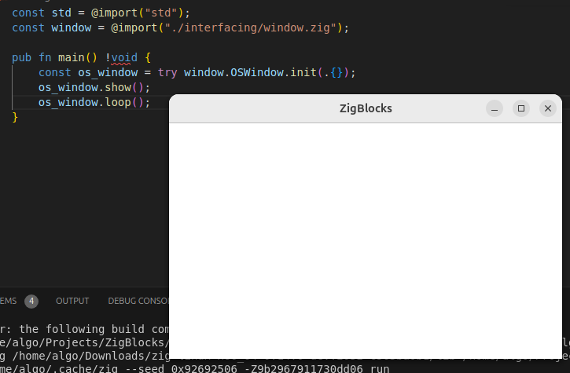

# Linux
Windows is, in many ways, lame. But that's besides the
point. Having the code work cross-platform is one of
the goals of this project and today, achieving this goal
was my target; and what a journey it has been.

I don't have any spare computers to install Linux on
so I had to spin up a Hyper-V instance of Ubuntu.
A fresh install means no tools, so I had to install
the Hyper-V guest tool suite, build-essential, etc.
All told, took maybe half an hour to 45 minutes.

Luckily, once ecerything was set up, zig built my
program without too much complaining (at this point,
it was only a hello world, though).

I Added the linux version of the vulkan library
to the project files, added libX11 to the linked
libraries, and started working on bindings.
I'm following
[this tutorial](https://github.com/gamedevtech/X11OpenGLWindow)
plus a few more resources to get started quickly,
and in the beginning, things were going ok.

## Win32 is nothing compared to X11
People say the win32 API is a bit obtuse. I can agree.
X11 has a somewhat simpler API, but the types are
significantly more complex. Look at the code for XEvent:

```c
typedef union _XEvent {
        int type;		/* must not be changed; first element */
	XAnyEvent xany;
	XKeyEvent xkey;
	XButtonEvent xbutton;
	XMotionEvent xmotion;
	XCrossingEvent xcrossing;
	XFocusChangeEvent xfocus;
	XExposeEvent xexpose;
	XGraphicsExposeEvent xgraphicsexpose;
	XNoExposeEvent xnoexpose;
	XVisibilityEvent xvisibility;
	XCreateWindowEvent xcreatewindow;
	XDestroyWindowEvent xdestroywindow;
	XUnmapEvent xunmap;
	XMapEvent xmap;
	XMapRequestEvent xmaprequest;
	XReparentEvent xreparent;
	XConfigureEvent xconfigure;
	XGravityEvent xgravity;
	XResizeRequestEvent xresizerequest;
	XConfigureRequestEvent xconfigurerequest;
	XCirculateEvent xcirculate;
	XCirculateRequestEvent xcirculaterequest;
	XPropertyEvent xproperty;
	XSelectionClearEvent xselectionclear;
	XSelectionRequestEvent xselectionrequest;
	XSelectionEvent xselection;
	XColormapEvent xcolormap;
	XClientMessageEvent xclient;
	XMappingEvent xmapping;
	XErrorEvent xerror;
	XKeymapEvent xkeymap;
	XGenericEvent xgeneric;
	XGenericEventCookie xcookie;
	long pad[24];
} XEvent;
```

Each one of those has it's own crap. There's no
way I'm binding all that to Zig.

## C to the rescue
Maybe this project is written in Zig, but that
doesn't mean we can't dip our toes into the beautiful
c language every once in a while.

The plan is to implement a lot of the X11 stuff
in c and then export a very simple interface that
we can call from Zig. This might get more and more
complicated as the need to actually handle
events in-application arises, but that's a problem
for another time.

While I do want to implement as much as possible
inside of Zig itself, I might just end up doing
a lot of this very c-heavy stuff (like both
of the platforms' windowing code) in c and exporting
an easy-to-use interface. There's no use writing
tons of crappy Zig whose only job is to call
c functions when you can write a little bit of
nice c instead. Here's what some of that looks like:

```c
typedef struct {
    Display* display;
    Screen* screen;
    Window window, root_window;
} X11DisplayReference;

extern X11DisplayReference initX11(){
    X11DisplayReference ref;

    ref.display = XOpenDisplay(NULL);
    assert(ref.display != NULL);

    ref.screen = DefaultScreenOfDisplay(ref.display);
    assert(ref.display != NULL);

    ref.root_window = RootWindowOfScreen(ref.screen);

    const int screenId = DefaultScreen(ref.display);

    ref.window = XCreateSimpleWindow(
        ref.display,
        ref.root_window,
        10, 10,
        500, 300,
        0,
        BlackPixel(ref.display, screenId),
        WhitePixel(ref.display, screenId)
    );
    XStoreName(ref.display, ref.window, "ZigBlocks");

    return ref;
}
```

Compare this to the ENTIRE Zig file:

```zig
pub const Display = *opaque{};
pub const Screen = *opaque{};
pub const Window = u64;

pub const X11DisplayReference = extern struct {
    display: ?Display,
    screen: ?Screen,
    root_window: Window,
    window: Window
};

pub extern fn initX11() X11DisplayReference;
pub extern fn showX11Window(ref: *const X11DisplayReference) void;
pub extern fn loopX11Window(ref: *const X11DisplayReference) void;
```

As it turns out, this idea (so far) works pretty well!
Ignore the error under the "voi" of "void" in this
screenshot. That's just ZLS being crap as per usual.



Maybe Zig isn't going to replace c, but instead, Zig
is going to work alongside it like a good friend.

Well anyways, it's 1:30AM and I have work in the morning
so that will be the end of today's work.