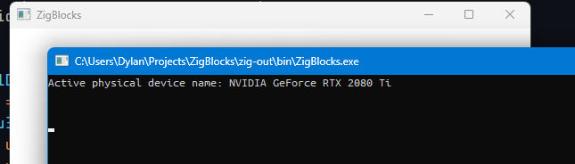

# Physical devices!
Today is a new day and I figured I could start
off by validating that the Vulkan code I wrote
and tested in Windows works in Linux too. So,
I went ahead and basically just copied the
code from my `winmain` to enumerate the list of
devices in my VM. Now, my graphics card doesn't
pass through to my VM and setting that up is
actually insane on Hyper-V, so I don't think I
ever will. However, we do get a virtual "gpu"
which runs on the CPU and Vulkan is more than
happy to use this. In fact, `vkcube` runs fine.

## Physical devices count: Linux

So, I added this to the `main.zig`...

```zig
const graphics_instance = try graphics.Graphics.init();

var physical_device_count: u32 = 99;
_ = vkfuncs.vkEnumeratePhysicalDevices(graphics_instance.vulkan_instance, &physical_device_count, null);
std.debug.print("Physical devices found: {d}\n", .{ physical_device_count });
```

...and got the correct output. Very glad that worked
without a hitch.


While we're at it, let's decouple that function
from Vulkan and make it a method on the
`Graphics` object.

Inside of `graphics.zig`:

```zig
pub fn getPhysicalDeviceCount(this: *const Graphics) !u32 {
    var count: u32 = undefined;
    const result = vkfuncs.vkEnumeratePhysicalDevices(this.vulkan_instance, &count, null);
    if(result != vktypes.VK_SUCCESS){
        return error.CouldNotEnumeratePhysicalDevices;
    }
    return count;
}
```

And now our main looks like this:

```zig
const graphics_instance = try graphics.Graphics.init();
std.debug.print("Physical device count: {}\n", .{ try graphics_instance.getPhysicalDeviceCount() });
```

That makes our "user space" code much nicer, plus,
since we don't need to be annoyed with checking the
`VkResult` each time in user space, it's more of
an attractive option to do error handling now.

## Getting physical device properties
The next step is to choose the best GPU to use for
the game. We can do this by getting a list of all
devices and then looking at their properties.

To do this, we call the function `vkGetPhysicalDeviceProperties`
which takes in a `VkPhysicalDevice` and a
`VkPhysicalDeviceProperties` struct. Unfortunately for me,
`VkPhysicalDeviceProperties` has a property
`VkPhysicalDeviceLimits` which has over 100 properties. I
did indeed decide to bind this to Zig by hand and it did
indeed take like 15 damn minutes. Oh well, not everything
in programming is glamorous.

So, after a bunch of binding and re-writing the
`Graphics` class a bit  (to be more friendly in
user-space), this is what I ended up with:



There's a couple newlines after the name for some reason
but I don't have the energy to care about that right now.
This actually worked without too much trouble, if you can
believe that. Time to try it on Linux.